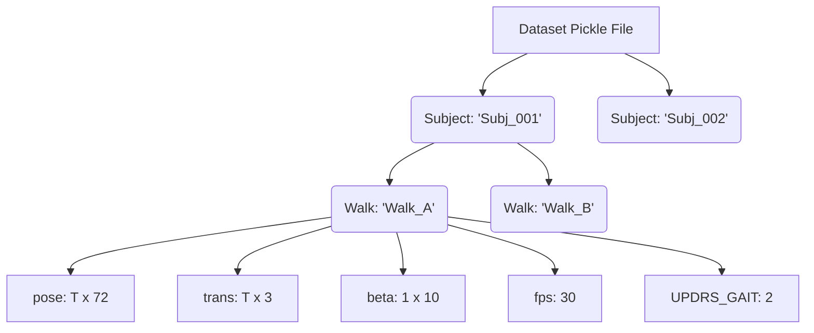
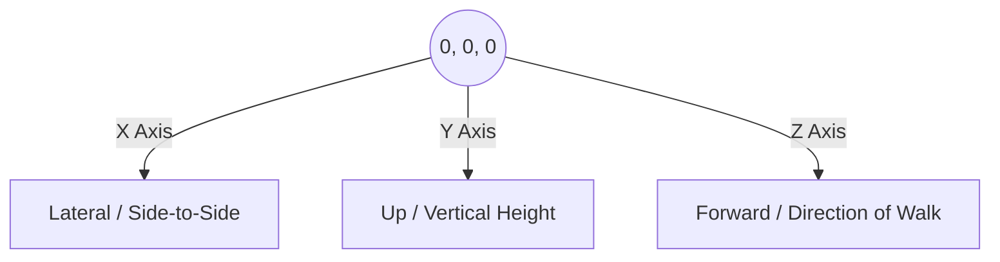

# Visual Explanation of the CARE-PD SMPL Data

This document breaks down the dataset structure visually, explaining how the Python dictionary translates into a 3D human walking sequence.

## 1. The Nested Dictionary Structure

Imagine the dataset as a filing cabinet. 
- The **Cabinet** is the `.pkl` file (e.g., `3DGait_canonical.pkl`).
- **Drawers** are the Subject IDs (individual patients).
- **Folders** are the Walk IDs (specific walking trials for that patient).
- **Documents** inside the folder are the actual data arrays (Pose, Trans, Beta, etc.).

---

## 2. Unpacking the Arrays

### `pose` (Shape: `T x 72`)
This array acts as the **"Strings on a Puppet"**.
- **`T`** = Number of frames in the video. If the walk is 3 seconds at 30 FPS, `T = 90`.
- **`72`** = The SMPL body model has 24 joints (including the root/pelvis). For each joint, there are 3 numbers representing its rotation in 3D space (axis-angle representation). `24 joints × 3 angles = 72 numbers`.
- **What it does:** It tells every limb, joint, and the spine exactly how much to bend and twist at every single frame.

### `trans` (Shape: `T x 3`)
This array acts as the **"Puppet Master's Hand"**.
- **`T`** = Number of frames.
- **`3`** = The Global X, Y, and Z coordinates.
- **What it does:** Even if the puppet's legs are moving (via `pose`), it won't actually move forward in the room unless the `trans` pushes the entire body forward through space. 

### `beta` (Shape: `1 x 10`)
This array determines the **"Body Type"** of the person.
- **`10`** = 10 shape coefficients (e.g., height, weight, arm length, shoulder width).
- **Privacy Note:** Because body shape can identify someone, the MoCha challenge organizers set all 10 values to `0.0`. This gives every subject an identical, average "mannequin" body shape, ensuring patient anonymity.

---

## 3. Canonicalization (The Virtual Environment)

Before canonicalization, patients were recorded in different clinics, walking in different directions (e.g., some walking diagonally across a camera, some walking left-to-right). 

"Canonicalization" forces every single patient to walk on the exact same virtual treadmill.

### The Coordinate System

### The Rules of Canonicalization
1. **`x = 0, z = 0` at Frame 1:** No matter where the patient started in the real clinic, they are teleported to the exact center of our virtual 3D room at the very first frame.
2. **`y = 0` (The Floor):** The patient's feet are mathematically aligned so they are stepping exactly on a flat virtual floor (`Y=0`). They aren't floating in the air or sinking into the ground.
3. **Facing Forward (`Z+`):** The patient's rotation is adjusted so they are always walking straight down the Z-axis.

---

## 4. The Target Label: `UPDRS_GAIT`

This is what our AI is trying to predict by watching the virtual puppet walk:
| Score | Meaning | What it might look like visually in the `pose/trans` arrays |
|---|---|---|
| **0** | Normal | Smooth, symmetrical limb movements; steady forward translation (`trans`). |
| **1** | Slight | Minor asymmetry, slightly shorter stride length. |
| **2** | Mild | Noticeable shuffling, reduced arm swing, slower forward translation. |
| **3** | Moderate / Severe | Severe shuffling, freezing of gait (moments where `trans` barely moves despite time passing), severe postural stoop. |

*(Note: If this value is `None`, it means the doctor didn't score this specific walk, so we must exclude it from our training.)*
